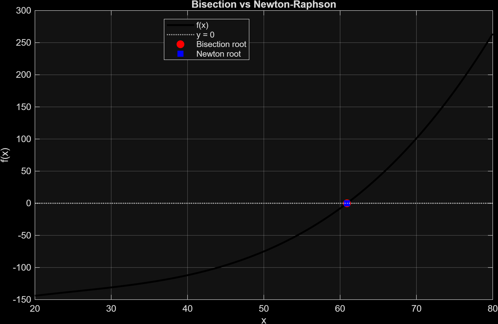
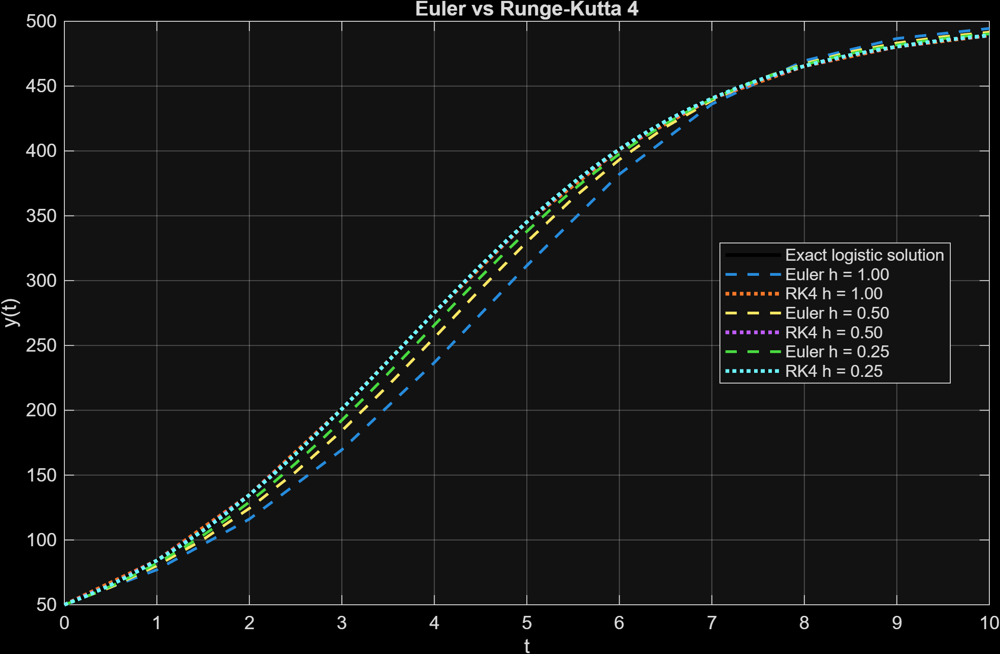
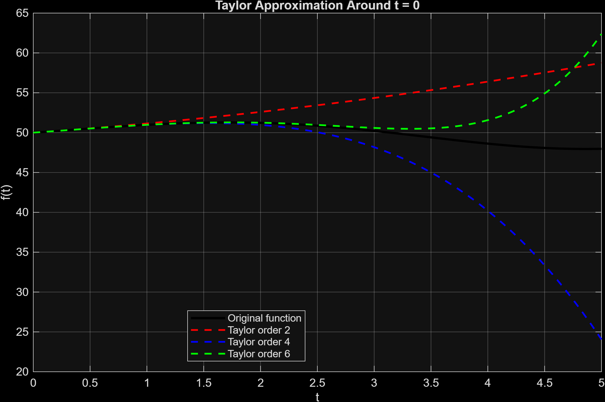
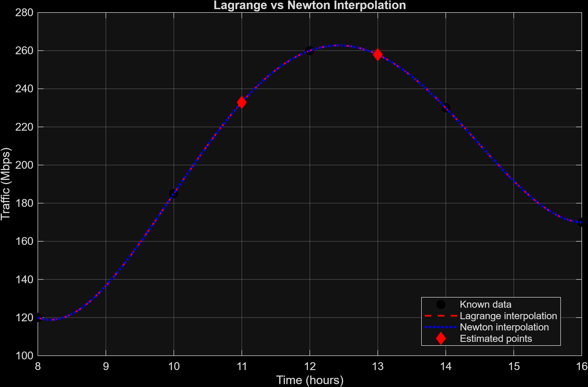
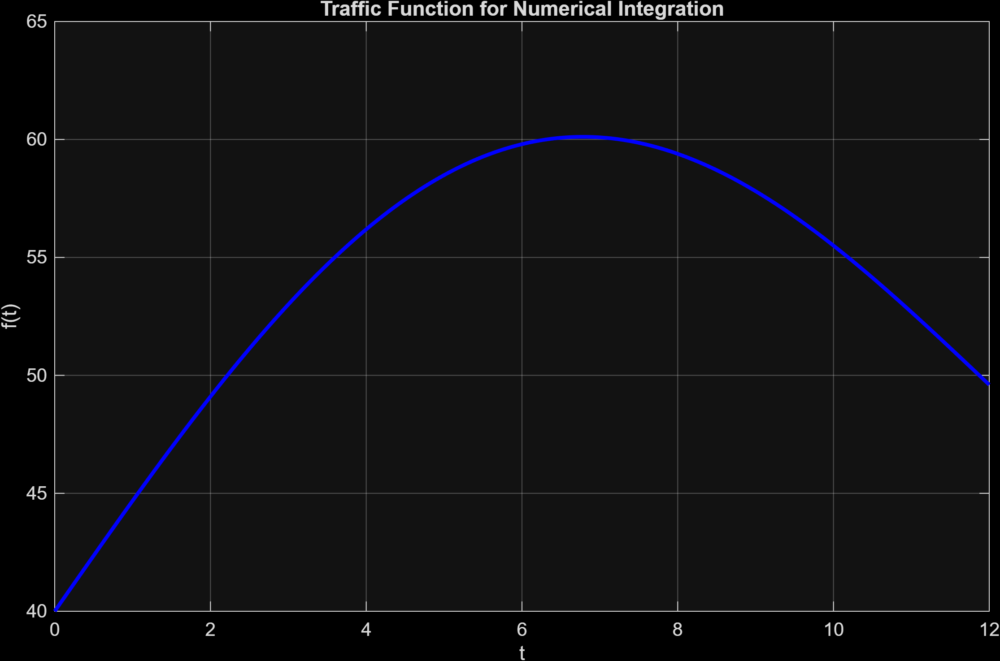

# Numerical Methods Analysis Suite


[Version en Espanol](./README.es.md)

Academic numerical analysis project built in MATLAB. This repository implements, compares, and visualizes five families of numerical methods applied to approximation, root finding, interpolation, integration, and ordinary differential equation problems.

The workflow is reproducible by design: running `main.m` executes all problem modules, generates high-resolution plots, exports `.csv` tables, and updates a consolidated report in `results/summary_report.txt`.

<p align="center">
  
  
</p>

## Table of Contents

- [Objective](#objective)
- [Implemented methods](#implemented-methods)
- [Project structure](#project-structure)
- [How to run](#how-to-run)
- [Key results](#key-results)
- [Generated artifacts](#generated-artifacts)
- [Technical design](#technical-design)
- [Authors](#authors)

## Objective

Apply classic numerical methods to modeled problems related to system behavior, demand, and performance, comparing accuracy, convergence, and experimental error through tabular and visual outputs.

The project covers:

- Local approximation with Taylor series.
- Root finding with closed and open methods.
- Polynomial interpolation for intermediate estimates.
- Numerical integration over traffic-related functions.
- Numerical solution of a logistic ODE.

## Implemented Methods

| Category | Methods | Main files | Output |
|---|---|---|---|
| Approximation | Taylor series | `methods/taylor_approximation.m` | Maximum error, mean error, and error near the expansion point |
| Root finding | Bisection and Newton-Raphson | `methods/bisection_method.m`, `methods/newton_raphson_method.m` | Approximate root, iterations, and final residual |
| Interpolation | Lagrange and Newton | `methods/lagrange_interpolation.m`, `methods/newton_interpolation.m` | Interpolated values, coefficients, and divided differences |
| Integration | Trapezoidal rule and Simpson's rule | `methods/trapezoidal_rule.m`, `methods/simpson_rule.m` | Approximate integral, step size, and absolute error |
| ODEs | Euler and Runge-Kutta 4 | `methods/euler_method.m`, `methods/runge_kutta_4.m` | Final approximation and maximum absolute error |

## Project Structure

```text
.
|-- main.m
|-- methods/
|   |-- bisection_method.m
|   |-- euler_method.m
|   |-- lagrange_interpolation.m
|   |-- newton_interpolation.m
|   |-- newton_raphson_method.m
|   |-- runge_kutta_4.m
|   |-- simpson_rule.m
|   |-- taylor_approximation.m
|   `-- trapezoidal_rule.m
|-- problems/
|   |-- problem_taylor.m
|   |-- problem_roots.m
|   |-- problem_interpolation.m
|   |-- problem_integration.m
|   `-- problem_ode.m
|-- results/
|   |-- figures/
|   |-- tables/
|   `-- summary_report.txt
|-- utils/
|   |-- ensure_results_directories.m
|   |-- save_figure_file.m
|   |-- save_table_file.m
|   `-- write_summary_report.m
`-- Entrega 1_ Planteamiento de Problemas y Contexto_ Metodos Numericos.pdf
```

## How to Run

### Requirements

- MATLAB with support for `table`, `writetable`, and `exportgraphics`.
- Recommended: MATLAB R2020a or newer.

### Local execution

Clone the repository:

```bash
git clone https://github.com/Estebangmz666/numerical_method_v1.git
cd numerical_method_v1
```

Open MATLAB at the project root and run:

```matlab
main
```

The main script is responsible for:

- Clearing the execution environment.
- Adding `methods`, `problems`, and `utils` to the MATLAB path.
- Creating result directories automatically when needed.
- Running the five problem modules.
- Exporting plots, tables, and the final summary report.

## Key Results

| Problem | Main finding |
|---|---|
| Taylor | The 6th-order polynomial reduces the error near the expansion point down to `0.019097`. |
| Root finding | Bisection and Newton-Raphson converge to `60.909843`; Newton-Raphson reaches it in 5 iterations. |
| Interpolation | Lagrange and Newton produce the same values at `x = 11` and `x = 13`, confirming the same interpolating polynomial. |
| Integration | Simpson's rule with 24 subintervals reaches an absolute error of about `0.00018729`. |
| ODE | Runge-Kutta 4 with `h = 0.25` achieves a maximum error of about `0.00029596`, far below Euler. |

<p align="center">
  
  
</p>

<p align="center">
  
</p>

## Generated Artifacts

All outputs are stored under `results/`:

- `results/summary_report.txt`: consolidated report with conclusions and main tables.
- `results/figures/*.png`: exported high-resolution visualizations.
- `results/tables/*.csv`: numeric metrics for each problem.

Available tables:

- `problem_1_taylor_metrics.csv`
- `problem_2_root_metrics.csv`
- `problem_3_interpolation_estimates.csv`
- `problem_3_lagrange_coefficients.csv`
- `problem_3_newton_divided_differences.csv`
- `problem_4_integration_metrics.csv`
- `problem_4_reference_integral.csv`
- `problem_5_ode_metrics.csv`

## Technical Design

The repository separates responsibilities to keep the code maintainable and scalable:

- `methods/` contains reusable implementations of the numerical methods.
- `problems/` defines the applied cases, parameters, visualizations, and exported tables.
- `utils/` centralizes directory creation, figure export, table export, and summary report generation.
- `main.m` acts as the single entry point.

The main functions return results and metadata that support convergence, error, and iteration analysis without coupling the numerical logic to presentation concerns.

## Authors

Project developed for a Numerical Analysis course.

- Esteban Gomez Leon
- Juan Antonio Betancourt Parra

Universidad del Quindio, Systems and Computer Engineering Program.
